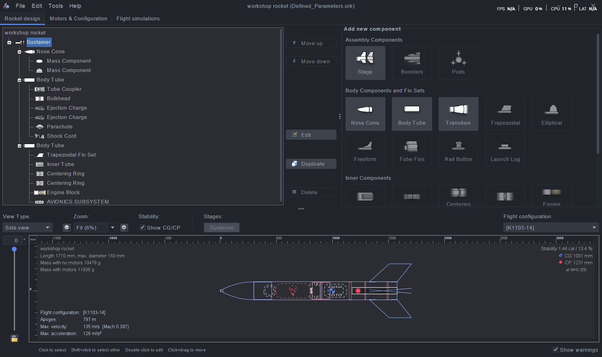
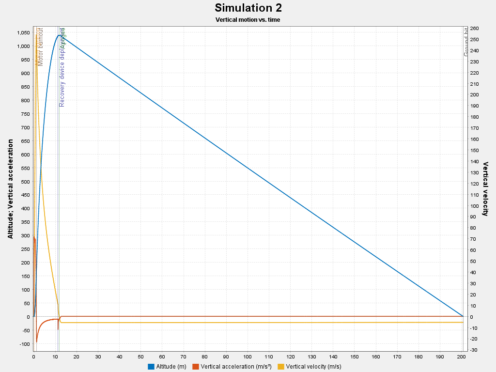

# Demo Rocket Design - Workshop Rocket
This project covers the initial design and stability parameters for a sustainer rocket model.

## Design Preview

## How to view this design
1. Download the `Defined_Parameters.ork` file from this folder.
2. Open it using [OpenRocket](https://openrocket.info/).

## Flight Simulation Analysis
The following plot illustrates the vertical motion of the rocket during simulation

### Key Observations:
*   **Boost Phase:** High vertical acceleration (orange) until **Motor Burnout**.
*   **Apogee:** The altitude (blue) peaks at approximately **797m**.
*   **Recovery:** The **Recovery Device Deployment** occurs at the peak, followed by a steady descent.
*   **Touchdown:** Total flight time is roughly **200 seconds**.

## Technical Specifications
- **Apogee:** 797 m
- **Max Velocity:** 135 m/s (Mach 0.397)
- **Max Acceleration:** 126 m/s²
- **Stability:** 1.44 cal / 13.4%

## Documents
- [OpenRocket Design File (.ork)](./Defined_Parameters.ork)