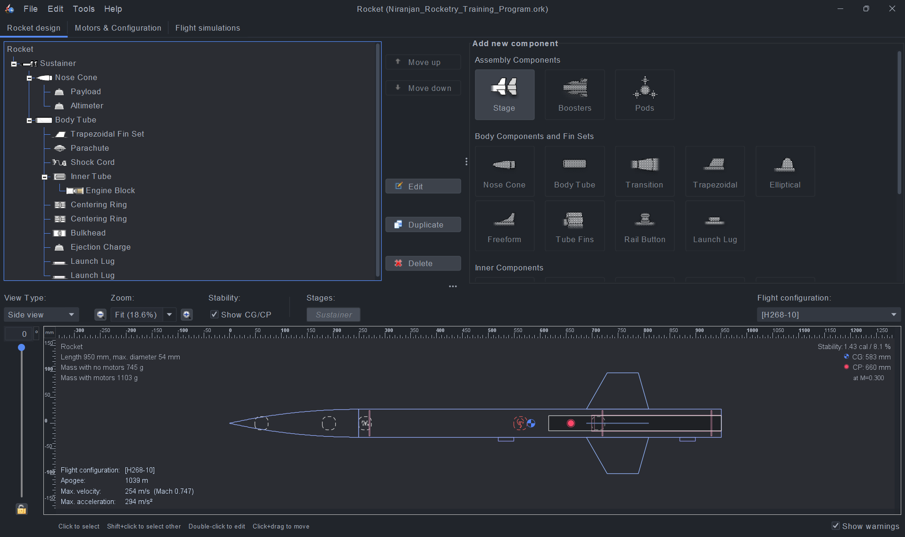

# OpenRocket Design Assignment: High-Altitude Model Rocket
### 🚀 India Space Lab - Winter Internship Training Program

This project contains the design and simulation for a high-performance rocket optimized for a 1000m+ apogee.

## 📋 Mission Objectives
* **Target Apogee:** > 1000 meters.
* **Stability:** 1.0 – 2.0 calibers.
* **Flight Regime:** Subsonic (Mach < 0.8).
* **Constraints:** 54mm body diameter.

## 📊 Simulation Results
* **Apogee:** 1052 m ✅
* **Max Velocity:** 255 m/s (Mach 0.75) ✅
* **Stability Margin:** 1.43 cal ✅
* **Ground Hit Velocity:** 5.73 m/s ✅

## 🖼️ Design & Flight Previews

### Rocket Internal Layout

### Flight Simulation Plot

## 📂 Repository Structure
* `Rocketry_Training_Program.ork` - OpenRocket source file.
* `images/rocketry_design_preview.png` - Internal component tree.
* `images/simulation_plot.png` - Flight performance graph.
* `Rocketry_Training_Program.pdf` - Technical justification report.

---
**Designed by Niranjan M P**